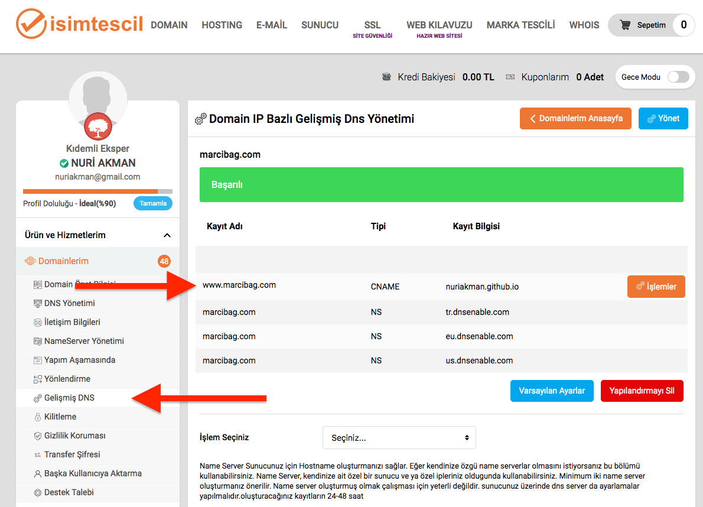
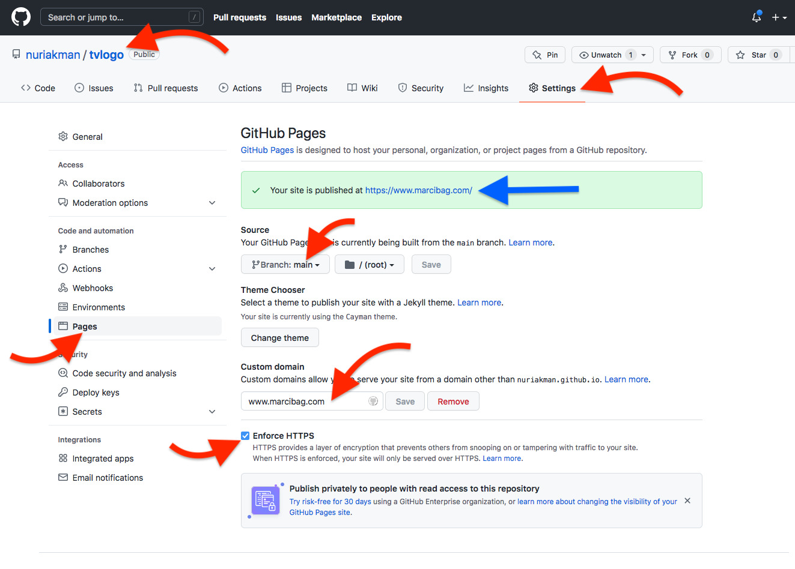

# Github Hosting Oluşturma

1. "https://domains.google/" adresine gidilir ve kendi hesabımızla oturum açılır.
2. "Alanlarım" kısmında ayar yapmak istediğimiz alanımız iin "Yönet" e tıklanır. (Bizim için "osmankayi.com")
3. "DNS" kısmında "Özel kayıtlar" bölümüne girilir ve "Özel kayıtarı yönet" e tıklanır.
4. | Ana makine adı | Tür   | TTL  | Veriler              |
   | -------------- | ----- | ---- | -------------------- |
   | www            | CNAME | 3600 | OsmanKAYI.github.io. |
   ayarları yapılır ve "Kaydet" butonuna tıklanır.

- www.isimtescil.net sitesinden alınan örnek aşağıdaki gibidir.
  

**NOTE:** Burada tür seçeneğini "CNAME" seçmemizin amacı ayarlarımıza github'ın ev sahipliği yapacak olmasıdır. Github hostinglerinde (CNAME) "www" kısmı bulunmak zorundadır. Eğer gerçek bir hosting satın alacaksak tür olarak "A" seçilir, "Ana makine adı" boş bırakılabilir (bu durumda sitemiz "osmankayi.com" olur) ve veriler kısmına "hostingIP" girilir.

5. Github'da herhangi bir isimle repository oluşturulur (örneğin; mywebsite).
6. Bu repository'de sırasıyla "Setting" ve "Pages" kısımlarına girilir.
7. "Source" bölümünde "Branch:main" ve "root" seçilir, ardından "Save" butonu ile kayıt edilir.
8. "Custom domain" bölümüne site adımız yazılarak (www.osmankayi.com) "Save" butonu ile kayıt edilir.
9. Son olarak "Enforce HTTPS" seçeneği kutusu işaretlenerek aktif hale getirilir.
10. Hosting'i github tarafından sağlanan sitemiz (".php" uzantılı dosyaları sitemizde kullanamıyoruz.) kullanıma hazır :).

- Github'dan alınan örnek aşağıdaki gibidir.
  
