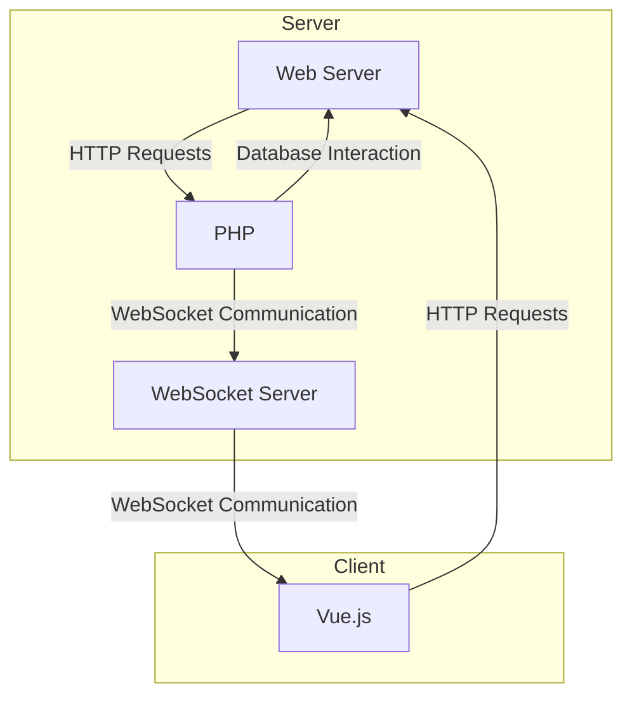

# Web Socket and Redis Usage

**WebSocket** is a computer communication protocol that provides a full-duplex communication channel over a single TCP connection. The WebSocket protocol was standardised by the IETF in 2011 with RFC 6455 and the WebSocket API in WebIDL is being standardised by W3C.

**Redis** is a data structure server. It is an open source, memory-aware, key-value repository. Redis stands for "Remote Dictionary Server". According to various sources, it is the most widely used key-value database.

- Create `publisher.php` file which sends the seconds that it is alive and the time when it sends the message.
- Save this files in anywhere on your system, we will run it after.

## Create Publisher with PHP

```php
// publisher.php
<?php
$redis = new Redis();
$redis->connect('127.0.0.1', 6379);

$i = 1;

$RESULT = array();
while (true) {
  $time = date('Y-m-d H:i:s');
  $RESULT['channel'] = "CHANNEL";
  $RESULT['data']['count'] = $i;
  $RESULT['data']['time'] = $time;
  $redis->publish('LIVESTREAM', json_encode($RESULT, JSON_UNESCAPED_UNICODE));

  if($i % 5 == 0) {
      $RESULT['channel'] = "CHANNEL_5";
      $redis->publish('LIVESTREAM', json_encode($RESULT, JSON_UNESCAPED_UNICODE));
  }
  if($i % 2 == 0) {
      $RESULT['channel'] = "CHANNEL_2";
      $redis->publish('LIVESTREAM', json_encode($RESULT, JSON_UNESCAPED_UNICODE));
  }
  echo "CHANNEL :: $time -- Counter: $i \n";
  if($i % 5 == 0) echo "CHANNEL_5 :: $time -- Counter: $i \n";
  if($i % 2 == 0) echo "CHANNEL_2 :: $time -- Counter: $i \n";
  sleep(0.01);
  $i++;
}
```

## Install Necessary Packages

```bash
# nodemon is a Node.js package that will watch for changes in a set of files and automatically restart a node application
npm -i -g nodemon
# wscat is a WebSocket client
npm -i -g wscat
```

## Create WebSocket Server

- Install dependencies and create ws server.

```bash
mkdir ws-server
cd ws-server
npm init -y
# express is a web application framework for Node.js
# ioredis is a Redis client for Node.js
# ws is a WebSocket library for Node.js
npm install express ioredis ws
# install types for TypeScript
npm install --save-dev @types/node
# install types of express and ws for TypeScript
npm install --save-dev @types/express @types/ws
```

- Create `server.ts` file in `ws-server` which will run the server.

```typescript
// ws-server/server.ts
import express, { Request, Response } from "express";
import http from "http";
import WebSocket from "ws";
import Redis from "ioredis";

// Define the structure of data coming from Redis
interface RedisData {
  channel: string;
  data: any;
}

// Declare __dirname to avoid TypeScript errors
declare var __dirname: string;

// Create an Express app, HTTP server, WebSocket server, and Redis client
const app = express();
const server = http.createServer(app);
const wss = new WebSocket.Server({ server });
const redis = new Redis();

// Variable to store the latest Redis data
let redisData: RedisData | null = null;

// Subscribe to the "LIVESTREAM" channel on Redis
redis.subscribe("LIVESTREAM", (err, count) => {
  if (err) {
    console.error("Error subscribing:", err);
  } else {
    console.log(
      `Successfully subscribed to the channel. Total subscriber count: ${count}`
    );
  }
});

// Listen for messages from the Redis channel
redis.on("message", (channel, message) => {
  console.log(`[${channel}] New message received: ${message}`);

  // Parse the incoming JSON message and store it
  redisData = JSON.parse(message) as RedisData;

  // Extract channel and data information
  const publishTo = redisData.channel;
  const publishData = redisData.data;

  // Send the updated data to all connected WebSocket clients
  wss.clients.forEach((client: WebSocket) => {
    if (client.readyState === WebSocket.OPEN) {
      client.send(JSON.stringify({ data: redisData }));
    }
  });
});

// Define an Express route to serve the HTML page
app.get("/", (req: Request, res: Response) => {
  res.sendFile(__dirname + "/index.html");
});

// Listen for WebSocket connections
wss.on("connection", (ws: WebSocket) => {
  // Send the current Redis data to a newly connected WebSocket client
  if (redisData !== null) {
    ws.send(JSON.stringify({ data: redisData }));
  }
});

// Start the server and listen on port 3000
server.listen(3000, () => {
  console.log("Server is running on http://localhost:3000");
});
```

- Now, run the server.

```bash
nodemon server.ts
```

- The server will run on `http://localhost:3000`. You can check it using `wscat` command.

  ```bash
  wscat -c ws://localhost:3000
  ```

- After this point, if you run `publisher.php`, you will see the messages on the screen.

```bash
php publisher.php
```

**Output for `publisher.php`**

```bash
### CHANNEL :: 2024-02-01 07:10:08 -- Counter: 1
### CHANNEL :: 2024-02-01 07:10:08 -- Counter: 2
### CHANNEL_2 :: 2024-02-01 07:10:08 -- Counter: 2
### CHANNEL :: 2024-02-01 07:10:08 -- Counter: 3
### CHANNEL :: 2024-02-01 07:10:08 -- Counter: 4
### CHANNEL_2 :: 2024-02-01 07:10:08 -- Counter: 4
### CHANNEL :: 2024-02-01 07:10:08 -- Counter: 5
### CHANNEL_5 :: 2024-02-01 07:10:08 -- Counter: 5
### ...
```

**Output for `server.ts`**

```bash
### [LIVESTREAM] New message received: {"channel":"CHANNEL","data":{"count":1,"time":"2024-02-01 07:10:08"}}
### [LIVESTREAM] New message received: {"channel":"CHANNEL","data":{"count":2,"time":"2024-02-01 07:10:08"}}
### [LIVESTREAM] New message received: {"channel":"CHANNEL_2","data":{"count":2,"time":"2024-02-01 07:10:08"}}
### [LIVESTREAM] New message received: {"channel":"CHANNEL","data":{"count":3,"time":"2024-02-01 07:10:08"}}
### [LIVESTREAM] New message received: {"channel":"CHANNEL","data":{"count":4,"time":"2024-02-01 07:10:08"}}
### [LIVESTREAM] New message received: {"channel":"CHANNEL_2","data":{"count":4,"time":"2024-02-01 07:10:08"}}
### [LIVESTREAM] New message received: {"channel":"CHANNEL","data":{"count":5,"time":"2024-02-01 07:10:08"}}
### [LIVESTREAM] New message received: {"channel":"CHANNEL_5","data":{"count":5,"time":"2024-02-01 07:10:08"}}
### ...
```

**Output for `wscat`**

```bash
### < {"data":{"channel":"CHANNEL","data":{"count":1,"time":"2024-02-01 07:10:08"}}}
### < {"data":{"channel":"CHANNEL","data":{"count":2,"time":"2024-02-01 07:10:08"}}}
### < {"data":{"channel":"CHANNEL_2","data":{"count":2,"time":"2024-02-01 07:10:08"}}}
### < {"data":{"channel":"CHANNEL","data":{"count":3,"time":"2024-02-01 07:10:08"}}}
### < {"data":{"channel":"CHANNEL","data":{"count":4,"time":"2024-02-01 07:10:08"}}}
### < {"data":{"channel":"CHANNEL_2","data":{"count":4,"time":"2024-02-01 07:10:08"}}}
### < {"data":{"channel":"CHANNEL","data":{"count":5,"time":"2024-02-01 07:10:08"}}}
### < {"data":{"channel":"CHANNEL_5","data":{"count":5,"time":"2024-02-01 07:10:08"}}}
### ...
```

## Use Taken Data on Vue 3

- Create a view named `RedisView` in `src/views` directory.

```typescript
// src/views/RedisView.vue
<script setup lang="ts">
import redisChannel from '@/components/redisChannel.vue';
</script>

<template>
  <main>
    <h1>Redis</h1>
    <div class="grid">
      <redisChannel channelName="CHANNEL" />
      <redisChannel channelName="CHANNEL_2" />
      <redisChannel channelName="CHANNEL_5" />
    </div>
  </main>
</template>
```

- Create a component named `redisChannel` in `src/components` directory.

```typescript
// src/components/redisChannel.vue
<script setup lang="ts">
import { ref, onMounted, onBeforeUnmount, defineProps } from 'vue';

// Define the expected structure of WebSocket data
interface WsData {
  count: number;
  time: string;
}

// Get the 'channelName' prop
const propChannelName = defineProps(['channelName'] as const);
const channelName = propChannelName.channelName;
console.log(channelName);

// Initialize the reactive variable for WebSocket data
const data = ref<WsData | null>(null);

// Create a WebSocket instance connecting to 'ws://localhost:3000'
const socket = new WebSocket('ws://localhost:3000');

// When the component is mounted, start listening for WebSocket messages
onMounted(() => {
  // Handle incoming WebSocket messages
  socket.onmessage = (event) => {
    try {
      // Parse the received JSON data
      const eventData = JSON.parse(event.data);
      const wsChannelName = eventData.redisData.channel;
      const wsChannelData = eventData.redisData.data;

      // Log the parsed data (optional)
      // console.table(eventData);

      // Check if the WebSocket channel name matches the prop channel name
      if (wsChannelName != channelName) return;

      // Update the reactive data with WebSocket channel data
      data.value = wsChannelData;
    } catch (error) {
      console.error('Data could not be parsed. Error:', error);
    }
  };
});

// When the component is about to be unmounted, close the WebSocket connection
onBeforeUnmount(() => {
  socket.close();
});
</script>

<template>
  <article>
    <h6>{{ channelName }}</h6>
    <div v-if="data !== null">
      <h1>{{ data.count }}</h1>
      <p>{{ data.time }}</p>
    </div>
  </article>
</template>
```

- Make necessary changes in `router.ts` in `src/router` directory.

```typescript
// src/router/index.ts
import { createRouter, createWebHistory } from "vue-router";
// other imports here
// other imports here
// other imports here
import RedisView from "@/views/RedisView.vue";

const router = createRouter({
  history: createWebHistory(import.meta.env.BASE_URL),
  routes: [
    {
      // other router settings here
      // other router settings here
      // other router settings here
      path: "/redis",
      name: "redis",
      component: RedisView,
      meta: {
        isShown: 1,
        requiresAuth: false,
        title: "Redis",
      },
    },
  ],
});

router.afterEach((to) => {
  document.title = to.meta.title ? String(to.meta.title) : DEFAULT_TITLE; // can not assign to document.title without calling String
});

export default router;
```

## PHP - Web Server - WebSocket Server - Vue.js Reactivity Diagram

- Mermaid code for the diagram

<script src="https://cdnjs.cloudflare.com/ajax/libs/mermaid/8.0.0/mermaid.min.js"></script>


